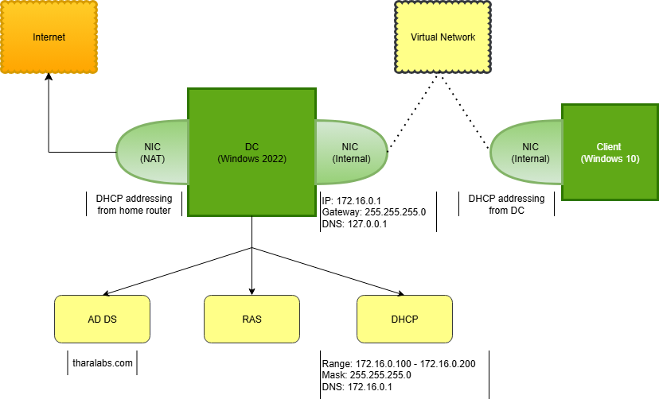

<h1>Active Directory Home Lab</h1>


<h2>Description</h2>
This project demonstrates the setup of a basic Active Directory Domain Controller in a virtualized lab environment using Windows Server 2022 and Windows 10. The lab includes DNS, DHCP, and RAS features, with domain-joined client machines, simulating a small office IT infrastructure.
<br />
<br />


| MACHINE  | OS                        | IP ADDRESS      | ROLE                                | NICs             |
|----------|---------------------------|-----------------|-------------------------------------|------------------|
| THLDC    | Windows Server 2022 Eval  | 172.16.0.1      | Domain Controller, DNS, DHCP, RAS,  | NAT + Internal   |
| Client01 | Windows 10 Eval           | DHCP - assigned | Domin-joined Client                 | Internal only    |

  

<h2>System Workflow</h2>

- The DC uses a static IP on the internal network (e.g., 172.16.0.1)
- The client connects to the DC via internal network only
- The DC connects to the internet via NAT and shares it to the client using RAS
- DHCP is used to assign IPs to clients
- DNS on the DC resolves domain-related names

- <h2>Tools Used</h2>

- <b>VirtualBox (hosted on Windows 11)</b>
- <b>Windows Server 2022 (Evaluation)</b>
- <b>Windows 10 (Evaluation)</b>

<h2>Network Diagram:</h2>

<p align="center">
  
</p>


<!--
 ```diff
- text in red
+ text in green
! text in orange
# text in gray
@@ text in purple (and bold)@@
```
--!>
